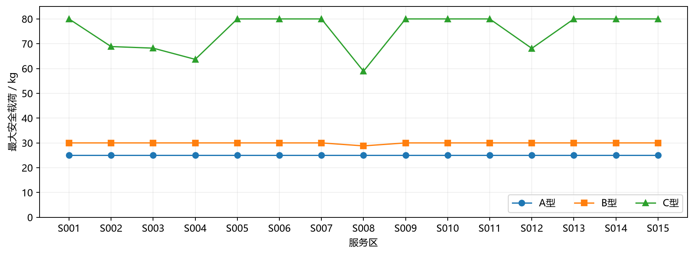
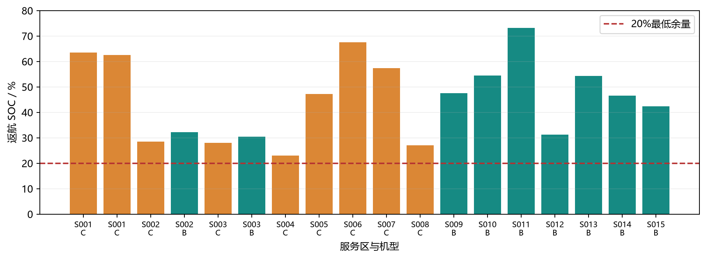
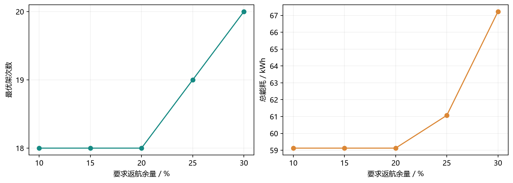

# 第一问：单点往返安全运力与精确组批

采用原始节点、货箱、机型与30米DEM，按“架次数、能耗、累计作业时间”词典序全量枚举与动态规划。
物理计算统一使用WGS84局部米制坐标、沿线全部相交DEM像元最高值、9.80665 m/s²重力加速度。
仅服务单区，返程空载；不施加机队、电池周转、送达时限与通信限制。

## 基准结果

80箱、758 kg、2.011 m³全部且仅配送一次；18架次（A0、B9、C9）。
总能耗 **59.127028 kWh**；累计作业时间 **32775.100 s**，约 **9.104 h**。
最低返航SOC **23.0891%**，高于20%要求。
累计时间是各架次之和，不表示多机并行完工时间。
水平飞行能耗56.572162 kWh，爬升能耗2.554866 kWh。

## 节能权衡

同一物理模型下，将能耗放在首位，得到19架次、59.029647 kWh。
相对基准只节约0.097381 kWh（0.1647%），
却增加1架次及27.733分钟累计作业时间。
因此18架次方案接近该模型的最低能耗，并非能耗明显偏高；“最低能耗”与“最少架次下最低能耗”须区别。

## 参考资料与计算口径

参考正文给出59.036497 kWh；本次统一口径比它增加0.090531 kWh，约0.1533%。
参考资料以约15米间隔采样地形并使用不同的平面距离和重力常数。
本实现按原题检查航段穿过的全部DEM像元，避免定距采样遗漏短暂穿过的像元；采用实际重算结果，不沿用参考数字。
没有取得参考资料宣称的独立MATLAB实现，本报告不重复该交叉验证声明。

## 敏感性与完整输出

| 要求余量 | 架次 | 能耗/kWh | 累计时间/s | 最低SOC |
|---:|---:|---:|---:|---:|
| 10% | 18 | 59.127028 | 32775.100 | 23.0891% |
| 15% | 18 | 59.127028 | 32775.100 | 23.0891% |
| 20% | 18 | 59.127028 | 32775.100 | 23.0891% |
| 25% | 19 | 61.069083 | 34564.743 | 27.0504% |
| 30% | 20 | 67.223040 | 36585.261 | 31.0194% |

`Q1_单点组批.csv`保留原题模板9列；逐箱归属、45组基准安全载荷及全部余量情景载荷、航线地形、优先级对照另列CSV。
`solution.json`保存全部候选模式、计数状态需求、选中模式和箱号；其他两份情景JSON保存完整替代方案。

## 核验与最优性范围

独立验证器用包围矩形内的线段—像元相交计算重建最高地形，重算货箱、能耗、时间、SOC和安全载荷。
此外独立枚举计数组批，再用HiGHS整数规划按三层目标逐层交叉验证各区DP目标值。
所有运行情景都通过；详见validation.json和manifest.json。DP无随机数、候选截断或状态截断。
最优性适用于声明的单点直线往返、确定性物理模型；整数计数精确，物理量为双精度浮点，交叉核验有数值容差。
有限DEM不代表亚像元真实障碍物；未建模的风场、悬停和充电损失不包含在本次能耗内。
仅测试10%、15%、20%、25%、30%，不将25%解释为精确换批阈值。

复现：在仓库根目录执行 `Group/Lcn/.venv/python.exe -B Group/Lcn/Code/run_q1.py`。
只读复核：追加 `--verify-only`。单元测试：在Code目录执行 `../.venv/python.exe -B -m unittest q1.test_q1 -v`。
