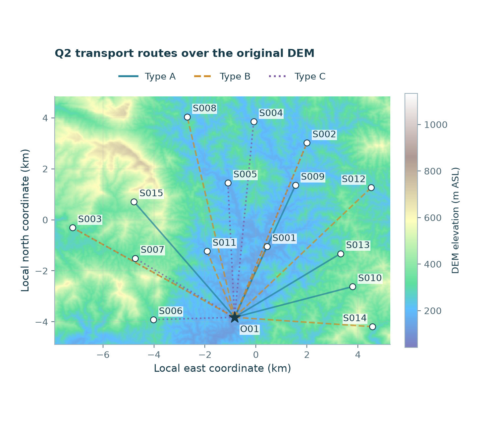
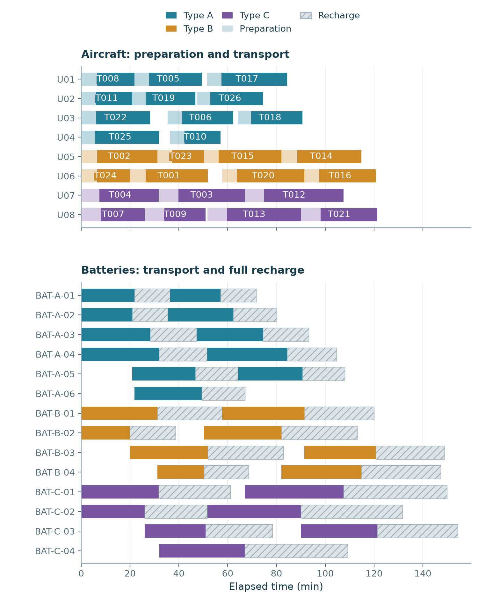
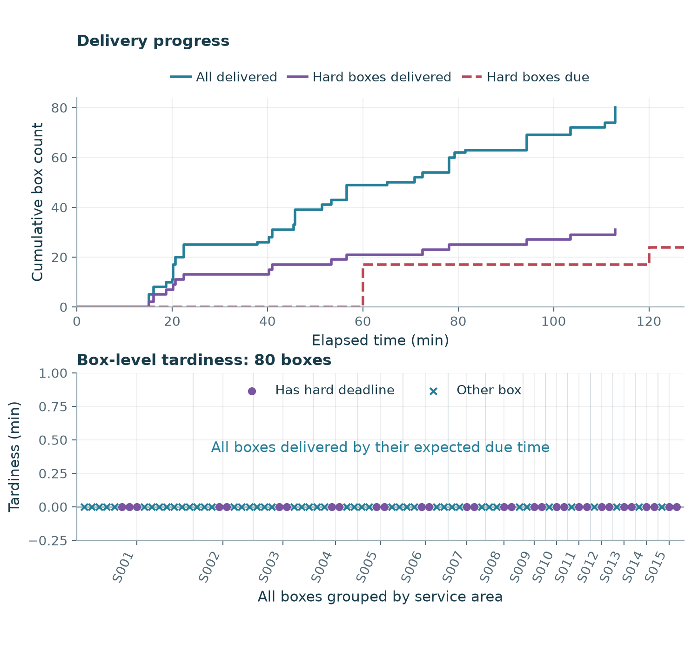
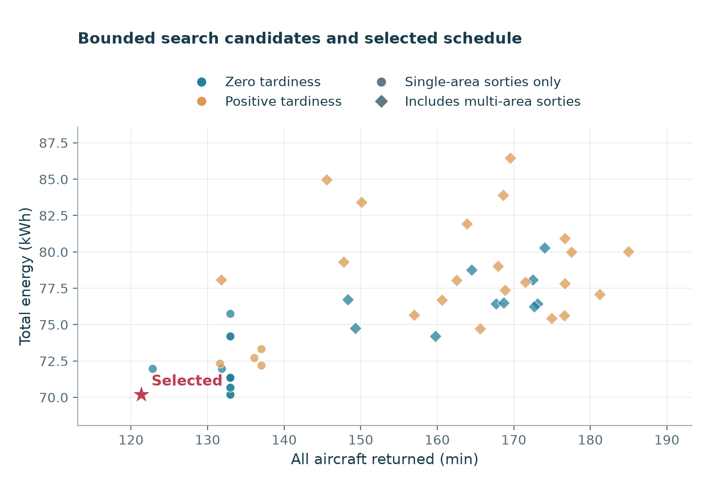

# 问题二：不考虑通信约束的物资运输调度

本方案直接读取原始货箱、机型、电池及DEM数据，独立执行货箱组批、访问路线、机型选择和资源排程，不读取问题三的方案文件，也不施加通信或中继约束。

独立核验：通过；检查数2075；错误数0。

## 核心结果

| 指标 | 结果 |
|---|---:|
| 完成交付 | 80箱 / 80箱 |
| 运输架次 | 26 |
| A/B/C型架次 | 11 / 8 / 7 |
| 全部返航时刻 | 121.303189 min |
| 末箱交付时刻 | 112.903845 min |
| 总能耗 | 70.186822743 kWh |
| 加权迟到 | 0.000000 加权秒 |
| 迟到箱数 | 0 |
| 硬时限违约箱数 | 0 |
| 最低返航SOC | 20.958406% |
| 多服务区架次 | 0 |

目标按加权迟到、全部返航时刻、总能耗、运输架次数字典序比较；不同目标的优先级属于明确的建模选择。

本方案所有货箱均在期望时限内完成交付，加权迟到为0，达到该非负指标的理论下界。这只证明第一层迟到目标达到下界，不证明后续完工时间、能耗或架次数的全局最优。

## 资源使用与充电

| 机型 | 无人机库存 | 使用编号数 | 电池库存 | 使用编号数 | 架次 | 能耗/kWh |
|---|---:|---:|---:|---:|---:|---:|
| A | 4 | 4 | 6 | 6 | 11 | 20.724898 |
| B | 2 | 2 | 4 | 4 | 8 | 17.479439 |
| C | 2 | 2 | 4 | 4 | 7 | 31.982486 |

无人机从准备开始占用至返回O01；电池从准备开始占用至返航后按两阶段规则充满。区间为左闭右开，相同时刻释放后可再次使用。运输机返航即可使用另一块同型满电电池开展准备，原电池继续充电；没有添加题目未给定的充电端口数量约束。

甘特图显示全部8架运输机和14块库存电池，空行表示该编号未使用；浅色为准备装载，深色为运输任务，阴影为电池充电。

## 逐箱交付

医疗箱的期望时限作为硬约束；带首批保障标记的指定货箱同时满足首批截止时间。一个箱有两个硬期限时取较早者，其余货箱允许迟到但计入应急优先系数加权的迟到目标。图中逐箱点按服务区排列，CSV可查全部80箱对应架次与准确送达时刻。

## 搜索范围与最优性边界

固定种子20260924，共执行48次构造，其中47次生成完整可行候选、31次包含多服务区架次。候选允许每架次最多3个服务区，在种子服务区最近4个候选邻区内枚举访问排列，并生成贪心组批的可行前缀。每步保留静态评分前32个候选和全部单服务区候选。

再对少量选定的箱集、路线和机型结构进行CP-SAT时序与实体分配精修，总预算上限120秒。采用1秒时间网格，任务与电池占用时长及送达偏移向上取整、硬期限向下取整；最终重新构造连续时间轨迹，以实际指标排序并独立核验。CP-SAT状态与界仅适用于对应固定结构的保守整数秒模型。

入选方案每架次只服务一个区，是当前目标次序下的候选比较结果；程序并未把单区访问设为问题二硬约束。多服务区方案纳入搜索，具体数量与指标见候选比较表。

候选图同时展示构造与成功精修方案：圆点表示全部单区架次，菱形表示包含多区架次；蓝色为零迟到，橙色为正迟到。它是有界搜索记录，不是全部可行解集或全局Pareto前沿。

## 物理口径与复现

采用原始30米DEM像元分片常值地形和局部WGS84米制坐标。每段使用先爬升、水平直飞、下降的航迹，巡航海拔为沿线最高DEM高程加50米与两端作业海拔的最大值；服务区交付高度30米。能耗使用载荷等效航程的水平项及重力爬升项，下降和交付悬停不另计运输能耗。这些是题面缺失公式下明确补充的口径，不能替代实机试验。

所有报告数据来自同目录 solution.json；validation.json 独立重建时序、能耗、SOC、逐箱期限和资源释放。manifest.json 记录原始输入与代码及输出的SHA-256。报告展示精度与机器可读原始浮点值不同，资源冲突验证始终使用未四舍五入的时刻。

## 文件

- `Q2_运输架次.csv`：原结果模板8列。
- `Q2_逐箱交付.csv`：原结果模板4列。
- `Q2_资源占用.csv`：逐架次机体、电池及充电释放时刻。
- `Q2_候选比较.csv`：构造及成功精修候选的指标与参数。
- 四张图均提供同名PDF，供论文直接引用；CSV为UTF-8 BOM编码、LF换行，时间字段以秒计。
