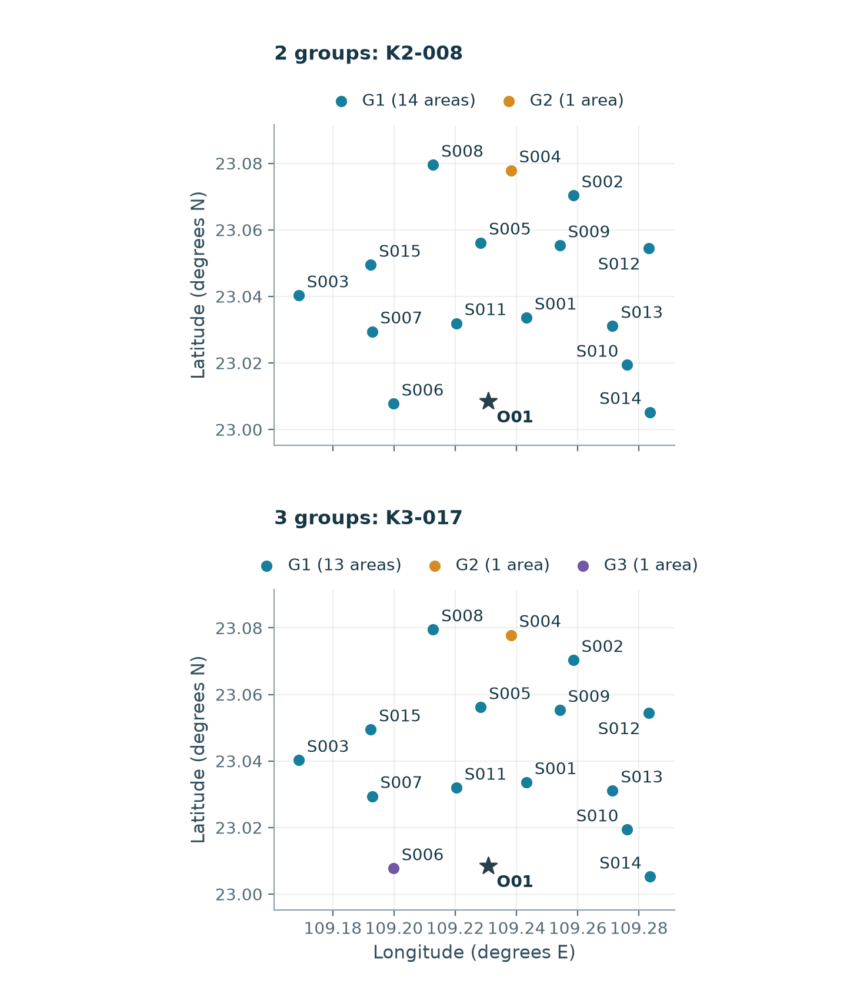
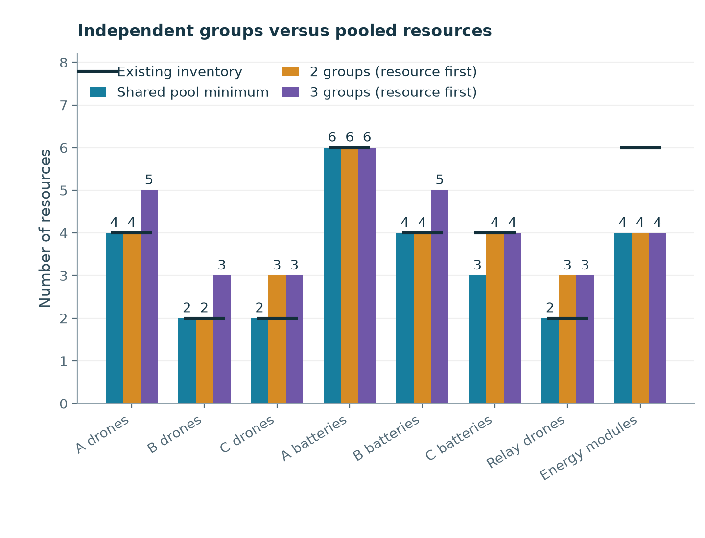
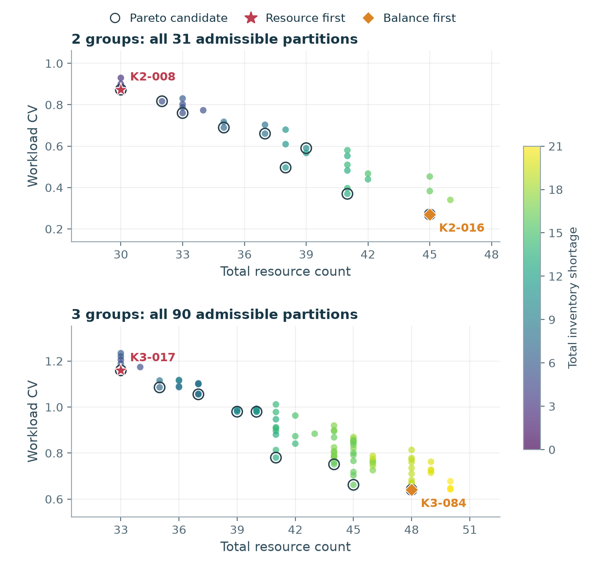

# 问题四：固定任务下的分区与独立资源配置

独立核验状态请参见同目录核验文件。

本报告固定问题三的货箱组批、访问顺序、任务时间、中继位置及通信保障关联，不复制中继架次。共享一个固定运输架次或中继架次的服务区合并为不可拆分单元，再穷举这些单元的非空分组。各组独立拥有资源，同型实体编号允许重新分配，但执行期间不跨组借用。

共有 **6 个不可拆分单元**：C01={S001}；C02={S002, S003, S005, S007, S008, S009, S010, S012, S013, S015}；C03={S004}；C04={S006}；C05={S011}；C06={S014}。

资源优先规则依次最小化库存缺口总件数、资源总件数、工作量变异系数（CV）；均衡对照则先最小化工作量CV，再比较缺口和资源总件数。不同机型或资源不能互相抵扣，资源总件数仅用作透明的计数指标，并非采购成本。

## 分区与指标

| K | 规则 | 候选 | 总资源件数 | 库存缺口 | 工作量CV | 货箱数CV |
|---:|---|---|---:|---:|---:|---:|
| 2 | 资源优先 | K2-008 | 30 | 2 | 0.872908 | 0.850000 |
| 2 | 均衡优先 | K2-016 | 45 | 16 | 0.270042 | 0.175000 |
| 3 | 资源优先 | K3-017 | 33 | 5 | 1.159683 | 1.096016 |
| 3 | 均衡优先 | K3-084 | 48 | 19 | 0.640737 | 0.541122 |

**2组**：完整枚举31种无标签分区，其中0种不超过现有库存。

**3组**：完整枚举90种无标签分区，其中0种不超过现有库存。

工作量为组内所有运输及中继架次从准备开始至返航的时长之和；充电与中继机返航周转用于资源占用，不重复计入工作量。CV采用各组工作量的总体标准差除以均值。分区不要求地理连通，地图仅展示点位归属，不绘制虚构区域边界。

## 分组细节

### 2组 · 资源优先 · K2-008

| 任务组 | 服务区 | 货箱数 | 质量/kg | 累计任务工作量/min |
|---|---|---:|---:|---:|
| G1 | S001, S002, S003, S005, S006, S007, S008, S009, S010, S011, S012, S013, S014, S015 | 74 | 699.0 | 1059.88 |
| G2 | S004 | 6 | 59.0 | 71.92 |

库存缺口：C型运输无人机1、中继无人机1。库存余量：中继能源组件2。
相对未分组共享池的额外配置：C型运输无人机1、C型电池组1、中继无人机1。

### 2组 · 均衡优先 · K2-016

| 任务组 | 服务区 | 货箱数 | 质量/kg | 累计任务工作量/min |
|---|---|---:|---:|---:|
| G1 | S001, S004, S006, S011, S014 | 33 | 322.0 | 413.09 |
| G2 | S002, S003, S005, S007, S008, S009, S010, S012, S013, S015 | 47 | 436.0 | 718.72 |

库存缺口：A型运输无人机4、B型运输无人机2、C型运输无人机1、A型电池组4、B型电池组3、中继无人机2。库存余量：中继能源组件1。
相对未分组共享池的额外配置：A型运输无人机4、B型运输无人机2、C型运输无人机1、A型电池组4、B型电池组3、C型电池组1、中继无人机2、中继能源组件1。

### 3组 · 资源优先 · K3-017

| 任务组 | 服务区 | 货箱数 | 质量/kg | 累计任务工作量/min |
|---|---|---:|---:|---:|
| G1 | S001, S002, S003, S005, S007, S008, S009, S010, S011, S012, S013, S014, S015 | 68 | 640.0 | 995.99 |
| G2 | S004 | 6 | 59.0 | 71.92 |
| G3 | S006 | 6 | 59.0 | 63.90 |

库存缺口：A型运输无人机1、B型运输无人机1、C型运输无人机1、B型电池组1、中继无人机1。库存余量：中继能源组件2。
相对未分组共享池的额外配置：A型运输无人机1、B型运输无人机1、C型运输无人机1、B型电池组1、C型电池组1、中继无人机1。

### 3组 · 均衡优先 · K3-084

| 任务组 | 服务区 | 货箱数 | 质量/kg | 累计任务工作量/min |
|---|---|---:|---:|---:|
| G1 | S001, S011 | 18 | 179.0 | 220.97 |
| G2 | S002, S003, S005, S007, S008, S009, S010, S012, S013, S015 | 47 | 436.0 | 718.72 |
| G3 | S004, S006, S014 | 15 | 143.0 | 192.11 |

库存缺口：A型运输无人机5、B型运输无人机3、C型运输无人机1、A型电池组4、B型电池组4、中继无人机2。库存余量：中继能源组件1。
相对未分组共享池的额外配置：A型运输无人机5、B型运输无人机3、C型运输无人机1、A型电池组4、B型电池组4、C型电池组1、中继无人机2、中继能源组件1。

## 资源需求与冗余口径

| 资源 | 共享池最少需要 | 库存 | 2组资源优先 | 3组资源优先 |
|---|---:|---:|---:|---:|
| A型运输无人机 | 4 | 4 | 4 | 5 |
| B型运输无人机 | 2 | 2 | 2 | 3 |
| C型运输无人机 | 2 | 2 | 3 | 3 |
| A型电池组 | 6 | 6 | 6 | 6 |
| B型电池组 | 4 | 4 | 4 | 5 |
| C型电池组 | 3 | 4 | 4 | 4 |
| 中继无人机 | 2 | 2 | 3 | 3 |
| 中继能源组件 | 4 | 6 | 4 | 4 |

共享池最少需要是固定全部任务后允许同型资源统一调配的峰值占用下界，不等于问题三原方案实际使用过的不同编号数量。各组资源需求取该组对应占用区间的最大重叠数；不同组需求相加会失去组间错峰共享机会。库存余量是库存减需求的非负部分；分组额外配置是分组需求减共享池下界，两者不是同一个冗余指标。

## 工作量与资源的权衡

下图展示全部已枚举候选。颜色为库存缺口，轮廓圈为同时比较缺口、资源总件数和工作量CV的Pareto候选，星号与菱形分别为两种优先规则的选择。二维投影中看似被支配的点可能在库存缺口维度更优。

## 计算边界与复核

资源占用区间采用左闭右开 [开始,结束)，相同时刻先释放再占用，保留问题三原始浮点时刻。运输机占用至返航，运输电池占用至返航后充满；中继机占用至返航后完成周转，能源组件占用至充满。输出的独立资源编号及逐架次占用构成组内可执行的资源分配证据。

穷举结论仅对固定问题三方案、不复制中继任务、同型资源可重新编号及当前目标排序的有限分区模型成立。不能推广为允许重排路线、改变时序或复制通信任务后的全局最优，也不能据此证明其他问题三方案没有更低的分区代价。

## 文件

- `Q4_分区配置.csv`：原模板11列，2组和3组资源优先配置。
- `Q4_均衡对照.csv`：相同模板列的均衡优先对照。
- `Q4_候选比较.csv`：全部候选、需求、缺口、CV及选择标记。
- `Q4_资源分配.csv`：两种规则下各组独立资源的逐架次占用。
- `Q4_资源比较.csv`：共享池、库存及两种规则配置的分类对照。
- 三张图均有同名PDF版本供论文引用；CSV使用UTF-8 BOM编码，所有时间字段以秒计。
